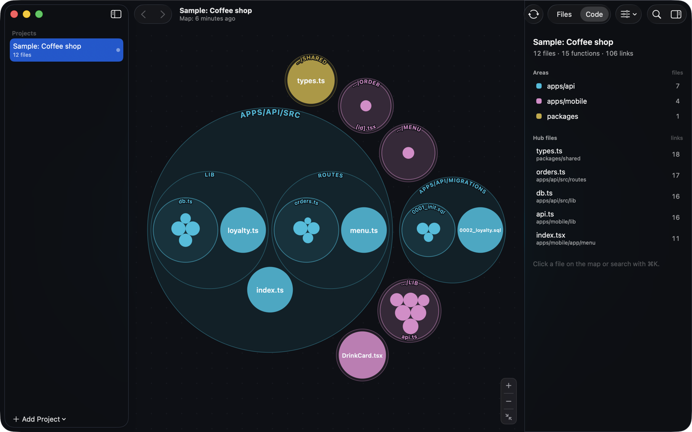
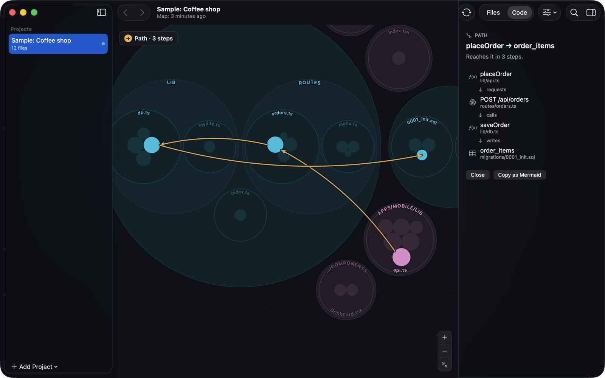

# Mapo

**A live map of your codebase — for you and for your AI agent.**

Mapo is a native macOS app that turns a project into a map you can read at a
glance: every ring is a folder, every circle a file, and the functions live
inside them. Click anything to see what it uses and what uses it — across the
mobile app, the API and the database.



## Why

- **See how a request travels.** Mapo connects client calls to the server
  routes they hit and to the tables those routes read and write: `placeOrder →
  POST /api/orders → saveOrder → order_items`.
- **Know what breaks before you change it.** *Impact* lists everything that
  depends on a file or function, ring by ring. *Find path* shows how any two
  pieces are connected.
- **Give your agent the same map.** Claude Code, Codex, Cursor and Claude
  Desktop connect in one click (MCP). They can ask "who calls this?", "what
  does this endpoint touch?", "what's affected if this changes?" instead of
  grepping.
- **Always current, always local.** The map updates when you save, commit or
  switch branches. Analysis runs entirely on your Mac — no account, no upload,
  no telemetry.



## What it understands

| | |
|---|---|
| Languages | TypeScript, JavaScript, Python, Swift, Go, Rust, Java, Kotlin and more (via [graphify](https://github.com/Graphify-Labs/graphify)) |
| HTTP | Hono, Express, Fastify, Koa, Elysia, Next.js route handlers, Cloudflare Workers (incl. service bindings), FastAPI, Flask, Django; clients via `fetch`, axios, ky, your own `get/post` wrappers, requests, httpx |
| RPC | tRPC routers and `useQuery` / `useMutation` calls |
| Databases | SQL migrations (Postgres, SQLite, D1), Prisma, Drizzle, Supabase |

Cross-boundary links are inferred from code patterns and marked as such;
click through to the source to confirm.

## Install

Download the latest `.dmg` from [Releases](https://github.com/Bur2ak/mapo/releases),
or with Homebrew:

```sh
brew install --cask bur2ak/tap/mapo
```

Requires macOS 14 or later on Apple silicon. Mapo updates itself (Sparkle).
On first launch, open the sample project to see what it does in ten seconds.

## Keyboard

| | |
|---|---|
| ⌘K | Search |
| ⌘[ / ⌘] | Back / forward |
| ⌘↑ | Go up (function → file → folder) |
| ⇧⌘P | Find path from the selection |
| ⇧⌘I | Show impact |
| ⇧⌘M | Copy as Mermaid |
| ⌘1 / ⌘2 | Files / Code |

## Build from source

macOS 14+, Xcode 16+, [XcodeGen](https://github.com/yonaskolb/XcodeGen), Node 20+.

```sh
bash scripts/build-engine.sh                 # bundled analysis engine
(cd Map && npm ci && npm run build)          # the map (TypeScript)
xcodegen generate && open Mapo.xcodeproj
swift test --package-path Packages/MapoCore
```

| Folder | |
|---|---|
| `App/` | SwiftUI app |
| `Packages/MapoCore/` | graph model, search, queries, HTTP/SQL bridges, MCP server (UI-free, tested) |
| `Map/` | the map: circle packing on Canvas (d3-hierarchy) |
| `Sample/CoffeeShop/` | the sample project shipped in the app |
| `docs/` | plan, design language, decision log (Turkish) |

## Feedback

Help › Send Feedback… in the app, or [open an issue](https://github.com/Bur2ak/mapo/issues).

## License

[Apache-2.0](LICENSE). Code analysis is built on
[graphify](https://github.com/Graphify-Labs/graphify) (Apache-2.0 / MIT).
Third-party notices ship inside the app (About › Third-Party Licenses).
